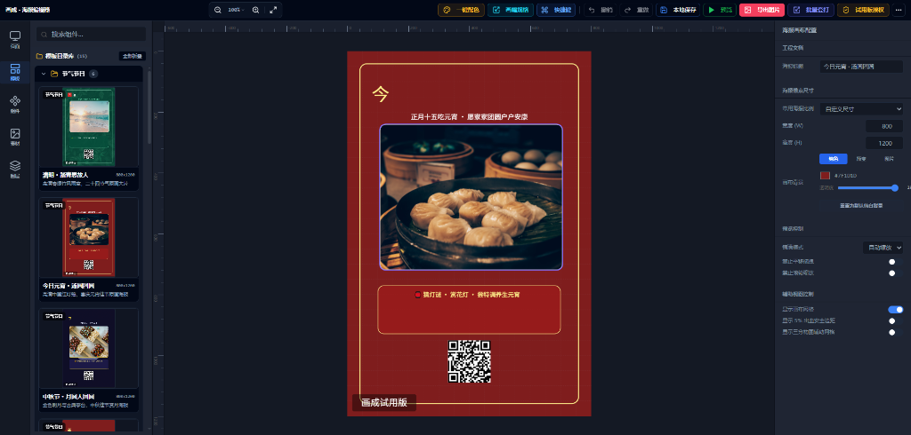

# PosterCraft 海报编辑器

> 基于 **Vite + React 18 + TypeScript + Leafer.js + TailwindCSS + Electron** 的可视化海报编辑器。适合前端毕设/课程设计、源码学习、海报工具二次开发，以及电商促销海报批量生成场景。



---

## 核心功能

### 1. Canvas 可视化编辑
- 基于 Leafer.js 渲染画布，支持拖拽、缩放、旋转、选中、多选、图层管理。
- 支持文字、图片、矩形/图形、二维码、条形码、马赛克遮罩等常用图元。

### 2. 模板与多页面
- 内置多类海报模板，可直接载入编辑。
- 支持页面/场景管理，可新建、复制、重命名、删除设计稿。
- 支持将当前模板或画布内容转存为独立场景。

### 3. 素材目录库
- 支持创建多个素材目录，例如商品图、品牌 Logo、促销贴纸。
- 选择目录后可导入图片素材，并保存到当前目录。
- 素材可从目录拖拽到画布使用，支持分页加载和本地 IndexedDB 存储。

### 4. 高清导出
- 支持 PNG、JPG、WebP 图片导出。
- 支持 1x、2x、3x 导出倍率和压缩质量配置。
- 使用离屏画布导出，减少当前视图缩放对成图质量的影响。

### 5. 批量套打
- 支持多组商品标题、价格、描述文案、二维码 URL。
- 可批量替换画布内容并导出多张高清海报。
- 适合电商促销、门店活动、课程招生等重复版式场景。

### 6. 字体、配色和图片效果
- 内置多套配色方案，可快速调整海报视觉风格。
- 字体工坊支持中英文字体选择和实时预览。
- 一键纯浅白背景消融与单色绿幕抠图。
- 模糊打码与马赛克粒子调节。
- 支持黑白、复古、高对比、模糊等图片滤镜。

### 7. 桌面端与源码交付
- 支持 Vite 静态站点构建。
- 支持 Electron Windows 桌面端打包。
- 项目结构清晰，适合二次开发和教学答辩。

---

## 技术栈架构

| 架构层级 | 使用技术 / 依赖包 |
| :--- | :--- |
| **前端框架** | React 18, TypeScript, Vite |
| **Canvas 渲染引擎** | Leafer.js (`leafer-ui`, `@leafer-in/export`) |
| **状态管理** | Zustand (`useEditorStore`) |
| **国际化多语言** | i18next, react-i18next |
| **样式与组件库** | TailwindCSS, Lucide Icons |
| **单元测试** | Vitest (内置 35+ 单元测试用例) |

---

## 快速启动

### 1. 克隆项目与安装依赖
```bash
git clone <repository-url>
cd poster-editor
npm install  # 或 yarn / pnpm install
```

### 2. 本地开发调试
```bash
npm run dev
```
打开浏览器访问 `http://localhost:5173` 即可开启海报设计体验。

### 3. 执行类型检查与单元测试
```bash
# 执行 TypeScript 类型安全检查
npx tsc --noEmit

# 执行 Vitest 自动化单元测试
npm run test
```

### 4. 打包网页版本
```bash
npm run build
```

### 5. 打包 Windows 桌面版
```bash
npm run electron:build
```

---

## 项目目录结构说明

```
poster-editor/
├── src/
│   ├── components/
│   │   ├── left-panel/      # 左侧资源面板（模板库、组件库、素材库、图层管理）
│   │   ├── right-panel/     # 右侧属性面板（图元属性、画布配置、字体工坊）
│   │   ├── top-toolbar/     # 顶部工具栏（尺寸预设、配色方案、快捷键、批量导出）
│   │   ├── feedback/        # 模态弹窗（高清导出、批量套打、快捷键对话框）
│   │   └── canvas/          # 核心 Canvas 编辑区与画幅自适应包装
│   ├── core/
│   │   ├── leafer/          # Leafer.js 渲染工厂与策略模式 runtime
│   │   ├── fonts/           # 字体库定义与加载器
│   │   └── export/          # 离屏导出与 Adapter 适配器
│   ├── locales/             # 国际化语言包 (zh.json, en.json, overrides.ts)
│   ├── store/               # Zustand 全局设计状态管理
│   └── lib/                 # 辅助函数库、预设模板与配色数据
├── docs/                    # 功能清单、上架交付、授权和买家教程
├── 部署与二次开发指南.md      # 部署与扩展二次开发文档
└── package.json
```

---

## 交付和二次开发文档

- [买家快速开始](docs/买家快速开始.md)
- [闲鱼上架与交付指南](docs/闲鱼上架与交付指南.md)
- [商业授权与素材版权说明](docs/商业授权与素材版权说明.md)
- [已实现功能清单](docs/已实现功能清单.md)
- [部署与二次开发指南](部署与二次开发指南.md)

---

## 适合用途

- 毕业设计 / 前端课程大作业项目
- 商业外包二次开发（如电商在线套打、定制名片生成器、卡片制作 SaaS）
- 个人独立开发者的设计工具 MVP
- 小商家活动海报和商品图批量生成工具

## 素材版权提示

项目内置模板和图片主要用于演示编辑器能力。正式商用前，建议替换为自己拥有版权或明确获得授权的图片、字体和品牌素材，并核验第三方资源的最新授权条款。
